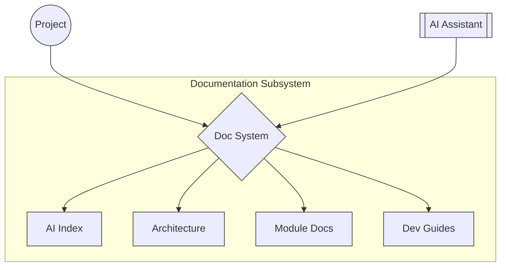
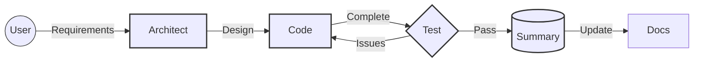

<div align="center">

# 🌟 Vibook — The living knowledge base behind Vibe Coding


<p><strong>AI-friendly project documentation for<br>continuous maintenance through AI assistance （Roo Code）</strong></p>

[English](README.md) | [中文](README.zh.md)

</div>

---

## 📖 Introduction

Vibook creates an "AI-understandable" knowledge network that helps AI coding assistants efficiently maintain existing projects.

| Capability | Implementation |
|:----:|:--------|
| 🔍 **Understand structure** | Directory organization & relationship mapping |
| 🎯 **Locate information** | Metadata tags & importance markers |
| 💡 **Comprehend intent** | Contextual marking system |
| 🚀 **Develop features** | Module implementation details |
| 🛠️ **Troubleshoot issues** | Clear documentation navigation paths |

## 🏗️ System Architecture

<div align="center">



</div>

## 🚀 Quick Start

1. **Prepare**: Install Roo Code with Claude 3.7 Sonnet or Gemini 2.5 Pro
2. **Start**: Switch to `architect` mode in Roo Code
3. **Input**: Choose [English](./ROO-PROMPT-EN.md) or [Chinese](./ROO-PROMPT.md) prompt
4. **Configure**: Answer questions to set up documentation system
5. **Adjust** (if needed): Run prompt again to reconfigure

> **Note**: Automatic documentation generation will create all necessary files and configurations based on your responses.

## 🔄 Mode Collaboration System

<div align="center">



</div>

### Mode Switching

Roo automatically suggests switching at appropriate times. If needed, manually direct:

```
"Please switch to Code mode to implement this feature"
"Now switch to Test mode to test our implementation"
"Please use Summary mode to document this work"
```

> Avoid UI mode switching as it may lose context. Include brief explanations when switching.

## 📋 Generated Documentation

| Category | Contents |
|:----:|:--------|
| **AI Index** | System overview, navigation guides, documentation standards |
| **Architecture** | System structure, tech stack details |
| **Modules** | Functional documentation, implementation details |
| **Guides** | Setup instructions, troubleshooting procedures |
| **Configuration** | Mode settings, rules, MCP integration |

---

<div align="center">

## Contribution & License

Issues and suggestions via [GitHub Issues](https://github.com/yourusername/vibook/issues)

**[MIT License](LICENSE)**

</div>