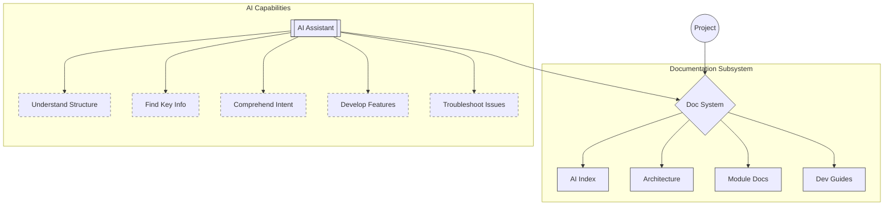
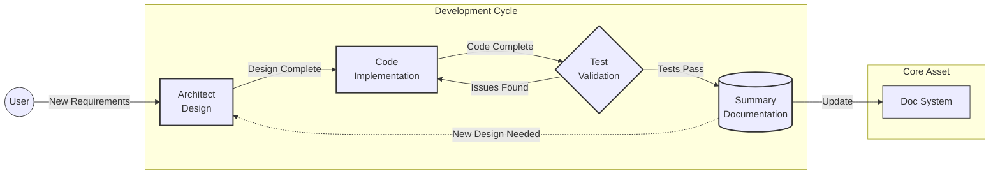

<div align="center">

# 🌟 Vibook — The living knowledge base behind Vibe Coding.


<br>
 


<p><strong>Provide structured, AI-friendly project context<br>Enable continuous maintenance through AI assistance</strong></p>

[English](README.md) | [中文](README.zh.md)

</div>

---

## 📖 Introduction

Vibook is a documentation management system optimized for AI coding assistants, creating an "AI-understandable" knowledge network that significantly improves development efficiency.

> 💡 **Proven effective in multiple real-world projects, now available for all developers**

Unlike traditional documentation, this system is designed specifically for AI tools, enabling them to:

| Capability | Description | Implementation |
|:----:|:-----|:--------|
| 🔍 **Understand project structure** | Quickly grasp the overall project | Clear directory organization and relationship mapping |
| 🎯 **Locate key information** | Efficiently find the most important content | Metadata tags and importance markers |
| 💡 **Understand code intent** | Gain deeper insight into design decisions | Contextual marking system |
| 🚀 **Develop new features efficiently** | Avoid duplicated work and conflicts | Module implementation details |
| 🛠️ **Troubleshoot effectively** | Quickly identify problem sources | Clear documentation navigation paths |

## ✨ Core Features

- 🏷️ **AI-optimized metadata system** - Tag system designed for AI comprehension
- 🔖 **Smart content marking** - Enhanced understanding of importance and context
- 🧭 **Navigation path optimization** - Help AI quickly locate needed information
- 🔄 **Mode collaboration mechanism** - Define efficient workflow processes
- 🔌 **MCP service integration** - Seamless integration with external knowledge services

---

## 🏗️ System Architecture

<div align="center">



</div>

### Core Components

- 📂 **Document Structure** - Customized documentation organization
- 🏷️ **Metadata System** - AI-understandable tagging framework
- 🔖 **Content Marking** - Importance and context classification
- 📜 **Rule Files** - AI assistant behavior guidelines
- 🎭 **Custom Modes** - Specialized AI configurations

---

## 🚀 Quick Start

### ⚙️ Prerequisites

1. Install and initialize Roo Code `(Recommended models: Claude 3.7 Sonnet / Gemini 2.5 Pro)`
2. Prepare your project codebase

### 📋 Usage Steps

<div align="center">

```
Architect mode → Paste Prompt → Answer questions → Auto-generated docs
```

</div>

1. **Switch Mode**: Switch to `architect` mode in Roo Code

2. **Input Prompt**: Choose based on language preference
   - English: [Prompt](./ROO-PROMPT-EN.md)
   - Chinese: [Prompt](./ROO-PROMPT.md)


3. **Initialization Process**: The system will automatically configure
   - ⚙️ Mode settings and collaboration rules
   - 🔌 MCP tool configuration
   - 📂 Documentation directory structure
   - 📑 Core document templates

4. **Customization**: The system will guide you through setting up
   - Project type and technology stack
   - Component relationships and documentation requirements
   - Test and summary mode configuration
   - MCP service integration

> **💡 Need to adjust configuration?** Simply run the prompt again and answer questions to reconfigure

### 🌟 Application Example

<table>
<tr>
<td>
<strong>Example Configuration (WIP)</strong><br>
✓ Feature 1<br>
✓ Feature 2<br>
✓ Feature 3
</td>
</tr>
</table>

---

## 🔄 Mode Collaboration System

### Mode Responsibilities

<div align="center">

| Mode | Icon | Primary Responsibility | Output |
|:----:|:----:|:---------|:---------|
| **Architect** | 🏗️ | System design and planning | Architecture design, task plans |
| **Code** | 💻 | Implementation and debugging | Functional code, API implementation |
| **Test** | 🔦 | Testing and quality assurance | Test reports, issue lists |
| **Summary** | 🗒️ | Documentation maintenance | Updated docs, change records |

</div>

### Collaboration Flow

<div align="center">



</div>

### Mode Switching

Roo will automatically suggest mode switching at appropriate stages. If not automatically triggered, you can manually direct:

```
📝 Enter switching instructions directly in conversation:

✓ "Please switch to Code mode to implement this feature"
✓ "Now switch to Test mode to test our implementation"
✓ "Please use Summary mode to document this work"
```

> **⚠️ Note**: It's not recommended to switch modes directly using the UI mode selector, as this may cause context information loss. When switching, briefly explain the completed work and next expectations to help AI better understand the task.

---

## 📋 Generated Content

<table>
<tr><th>Function Module</th><th>Contains</th></tr>
<tr><td>📑 <b>AI Index Docs</b></td><td>System overview, navigation guide, documentation standards</td></tr>
<tr><td>🏗️ <b>Architecture Docs</b></td><td>Architecture overview, tech stack details</td></tr>
<tr><td>📘 <b>Module Docs</b></td><td>Documentation organized by functional module</td></tr>
<tr><td>📚 <b>Dev Guides</b></td><td>Environment setup, troubleshooting methods</td></tr>
<tr><td>🎭 <b>Custom Modes</b></td><td>Test mode, summary mode configuration</td></tr>
<tr><td>📜 <b>Rule Files</b></td><td>General rules, mode-specific rules</td></tr>
<tr><td>🔌 <b>MCP Config</b></td><td>External service usage scenario definitions</td></tr>
</table>


---

<div align="center">

## Contribution

Feel free to submit issues and improvement suggestions via [GitHub Issues](https://github.com/yourusername/vibook/issues)

**[MIT License](LICENSE)** • Free to use, modify and distribute

</div>