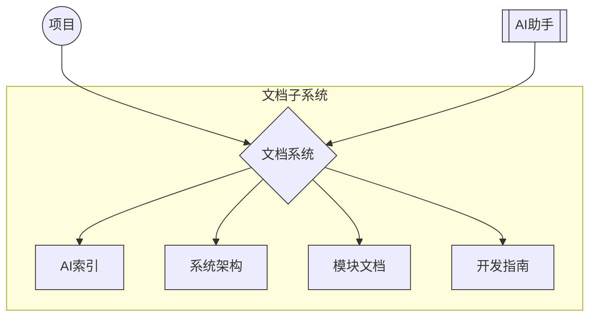

<div align="center">

# 🌟 Vibook — 自动维护的 Vibe Coding 项目知识库


<p><strong>为AI编码助手（Roo Code）提供结构化项目上下文<br>实现已有项目通过AI持续高效维护</strong></p>

[English](README.md) | [中文](README.zh.md)

</div>

---

## 📖 简介

Vibook创建一个"AI可理解"的知识网络，帮助AI编码助手高效维护现有项目。

| 能力 | 实现方式 |
|:----:|:--------|
| 🔍 **理解项目结构** | 目录组织与关系映射 |
| 🎯 **定位关键信息** | 元数据标签与重要性标记 |
| 💡 **理解代码意图** | 上下文标记系统 |
| 🚀 **开发新功能** | 模块实现细节文档 |
| 🛠️ **排查问题** | 明确的文档导航路径 |

## 🏗️ 系统架构

<div align="center">



</div>

## 🚀 快速上手

1. **准备**：安装Roo Code（推荐Claude 3.7 Sonnet或Gemini 2.5 Pro）
2. **开始**：切换到Roo Code的`architect`模式
3. **输入**：选择[中文](./ROO-PROMPT.md)或[英文](./ROO-PROMPT-EN.md)提示词
4. **配置**：回答问题设置文档系统
5. **调整**（如需）：重新执行提示词进行重新配置

> **注意**：自动文档生成将根据您的回答创建所有必要的文件和配置。

## 🔄 模式协作系统

<div align="center">


</div>

### 模式切换

Roo会在适当时机自动建议切换。如需手动指示：

```
"请切换到Code模式实现这个功能"
"现在切换到Test模式进行测试"
"请使用Summary模式总结这次的工作"
```

> 避免使用界面切换模式，这可能导致上下文丢失。切换时简要说明已完成工作和期望。

## 📋 生成文档

| 类别 | 内容 |
|:----:|:--------|
| **AI索引** | 系统总览、导航指南、文档标准 |
| **系统架构** | 系统结构、技术栈详情 |
| **模块文档** | 功能文档、实现细节 |
| **开发指南** | 环境设置、问题排查 |
| **配置文件** | 模式设置、规则、MCP集成 |

---

<div align="center">

## 贡献与许可

问题和建议请通过[GitHub Issues](https://github.com/yourusername/vibook/issues)提交

**[MIT License](LICENSE)**

</div>