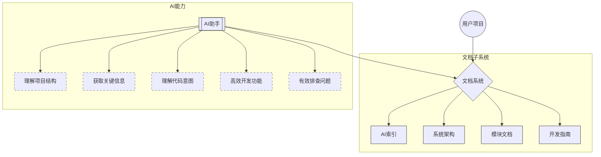
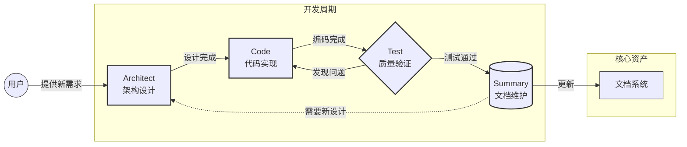

<div align="center">

# 🌟 Vibook — Vibe Coding 背后的知识库


<br>
 


<p><strong>为AI编码助手提供结构化、易于理解的项目上下文<br>让已有项目通过AI持续高效维护</strong></p>

[English](README.md) | [中文](README.zh.md)

</div>

---

## 📖 简介

Vibook是专为AI编码助手优化的文档管理系统，创建"AI可理解"的知识网络，极大提升AI助手开发效率。

> 💡 **已在多个实际项目中验证有效，现分享给所有开发者使用**

与传统文档不同，本系统专为AI工具设计，让AI能够：

| 能力 | 说明 | 实现方式 |
|:----:|:-----|:--------|
| 🔍 **快速理解项目结构** | 迅速掌握项目全貌 | 清晰的目录组织和关系映射 |
| 🎯 **精准定位关键信息** | 高效找到最重要内容 | 元数据标签和重要性标记 |
| 💡 **理解代码意图与背景** | 深入理解设计决策 | 上下文标记系统 |
| 🚀 **高效开发新功能** | 避免重复工作和冲突 | 模块实现细节文档 |
| 🛠️ **快速排查问题** | 迅速定位问题根源 | 明确的文档导航路径 |

## ✨ 核心功能

- 🏷️ **AI优化元数据系统** - 专为AI理解设计的标签体系
- 🔖 **智能内容标记** - 增强对重要性和上下文的理解
- 🧭 **导航路径优化** - 帮助AI快速定位所需信息
- 🔄 **模式协同机制** - 定义高效协作流程
- 🔌 **MCP服务集成** - 无缝对接外部知识服务

---

## 🏗️ 系统架构

<div align="center">



</div>

### 核心组件

- 📂 **文档目录结构** - 定制化的文档组织方式
- 🏷️ **元数据标签系统** - AI可理解的标签体系
- 🔖 **内容标记系统** - 重要性和上下文分类
- 📜 **规则文件** - AI助手行为指南
- 🎭 **自定义模式** - 专项任务AI配置

---

## 🚀 快速上手

### ⚙️ 准备工作

1. 安装并初始化Roo Code `(推荐模型: Claude 3.7 Sonnet / Gemini 2.5 Pro)`
2. 准备好您的项目代码库

### 📋 使用步骤

<div align="center">

```
Architect模式 → 粘贴Prompt → 回答问题 → 文档系统自动生成
```

</div>

1. **切换模式**：在Roo Code中切换到`architect`模式

2. **输入Prompt**：根据语言选择
   - 中文版：[Prompt](./ROO-PROMPT.md)
   - 英文版：[Prompt](./ROO-PROMPT-EN.md)


3. **初始化流程**：系统会自动配置
   - ⚙️ 模式设定与协同规则
   - 🔌 MCP工具配置
   - 📂 文档目录结构
   - 📑 核心文档模板

4. **个性化配置**：系统会引导您设置
   - 项目类型与技术栈
   - 组件关系与文档需求
   - 测试和总结模式配置
   - MCP服务集成

> **💡 调整配置？** 只需再次执行prompt，重新回答问题即可

### 🌟 应用实例

<table>
<tr>
<td>
<strong>应用示例 (开发中)</strong><br>
✓ 功能1<br>
✓ 功能2<br>
✓ 功能3
</td>
</tr>
</table>

---

## 🔄 模式协作系统

### 模式职责一览

<div align="center">

| 模式 | 图标 | 主要职责 | 输出成果 |
|:----:|:----:|:---------|:---------|
| **Architect** | 🏗️ | 系统设计和规划 | 架构设计、任务计划 |
| **Code** | 💻 | 代码实现和调试 | 功能代码、API实现 |
| **Test** | 🔦 | 测试和质量保证 | 测试报告、问题清单 |
| **Summary** | 🗒️ | 文档维护和总结 | 更新文档、变更记录 |

</div>

### 协作流程

<div align="center">



</div>

### 模式切换

Roo会在适当阶段自动触发模式切换建议。若未自动触发，可手动指示：

```
📝 直接在对话中输入切换指令：

✓ "请切换到Code模式实现这个功能"
✓ "现在切换到Test模式进行测试"
✓ "请使用Summary模式总结这次的工作"
```

> **⚠️ 注意**：不推荐通过界面选择器直接切换模式，这会导致上下文信息丢失。切换时应简要说明已完成工作和下一步期望，帮助AI更好理解任务。

---

## 📋 系统生成内容

<table>
<tr><th>功能模块</th><th>包含内容</th></tr>
<tr><td>📑 <b>AI索引文档</b></td><td>系统总览、导航指南、文档标准指南</td></tr>
<tr><td>🏗️ <b>系统架构文档</b></td><td>架构概览、技术栈详情</td></tr>
<tr><td>📘 <b>模块文档</b></td><td>按功能模块组织的详细说明</td></tr>
<tr><td>📚 <b>开发指南</b></td><td>环境搭建、问题排查方法</td></tr>
<tr><td>🎭 <b>自定义模式</b></td><td>测试模式、总结模式配置</td></tr>
<tr><td>📜 <b>规则文件</b></td><td>通用规则、模式特定规则</td></tr>
<tr><td>🔌 <b>MCP配置</b></td><td>外部服务使用场景定义</td></tr>
</table>


---

<div align="center">

## 参与贡献

欢迎通过[Issues](https://github.com/yourusername/vibook/issues)提交问题和改进建议

**[MIT License](LICENSE)** • 自由使用、修改和分发

</div>